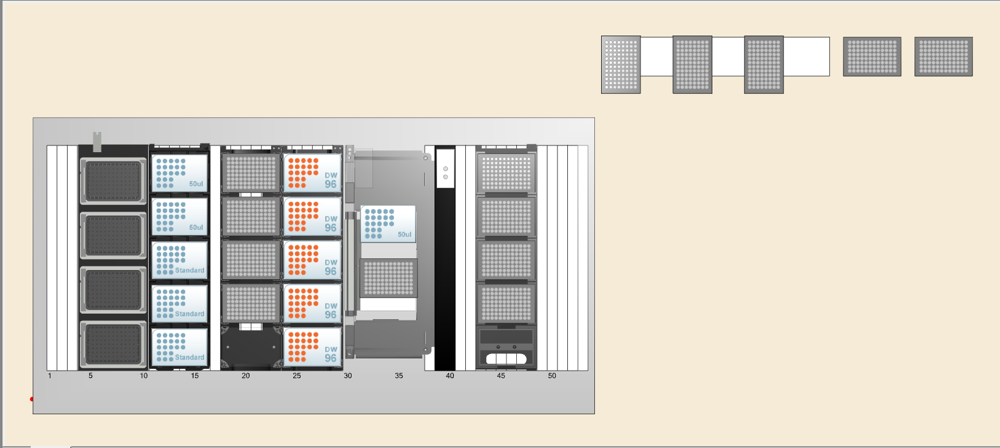
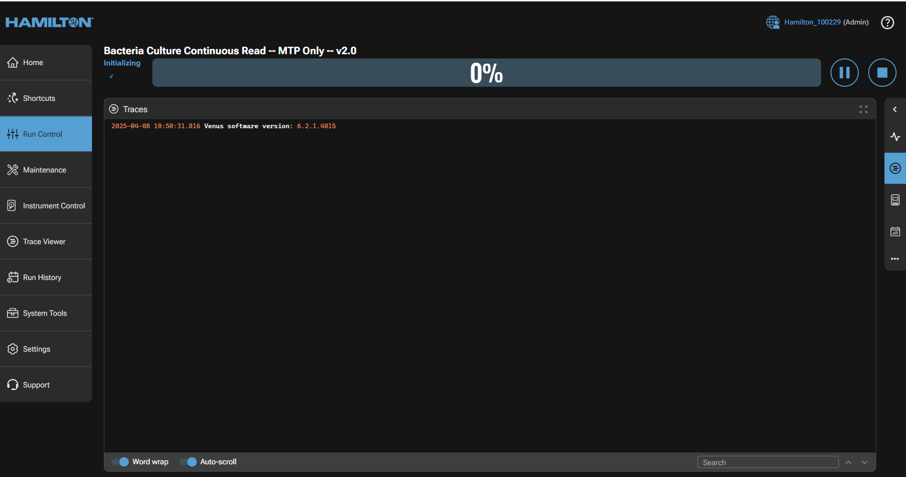
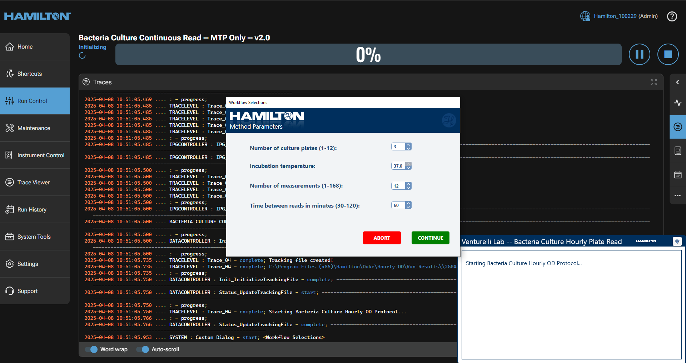
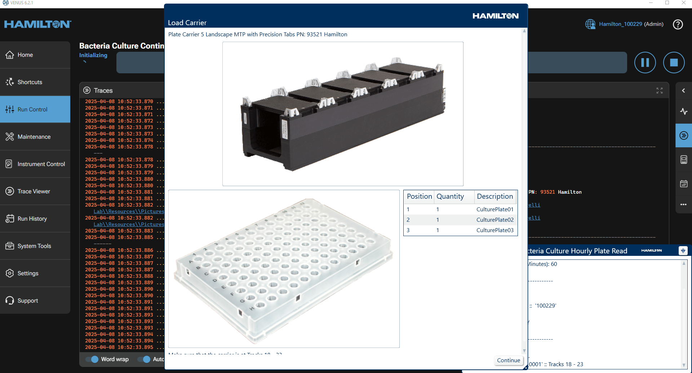
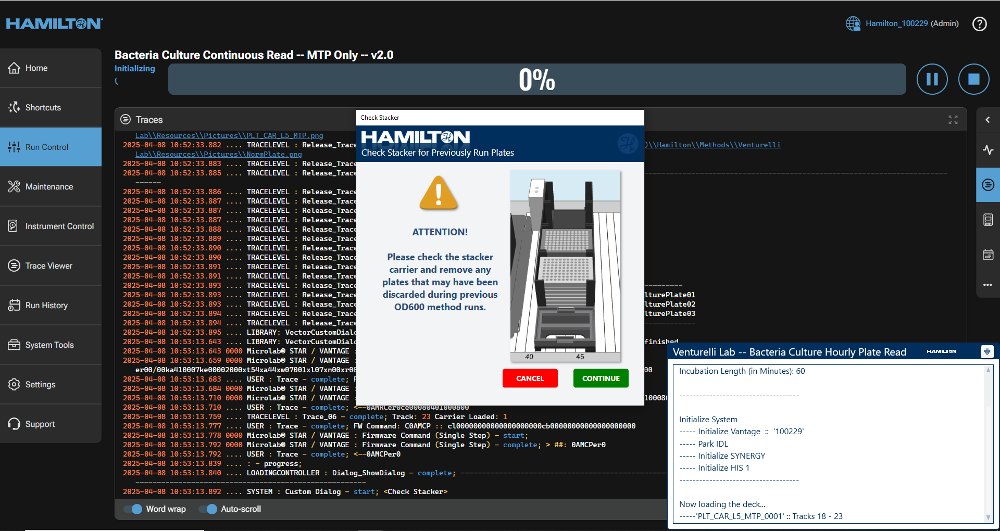
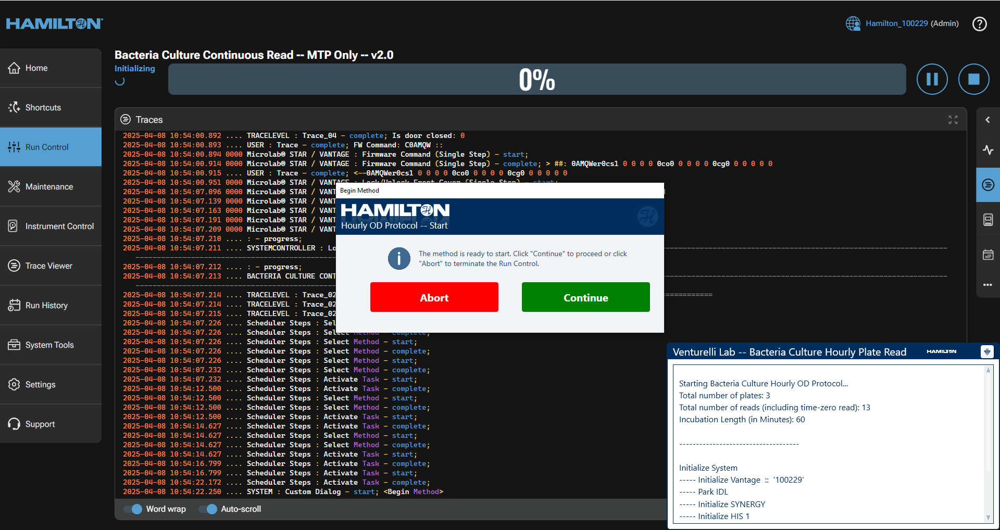

# Kinetic Cycle Protocol

Used to repeatedly transfer culture plates to the plate reader on a regular cadence throughout the run. Plates will be read in the Synergy plate reader. Duration of runs may be between 1 and 3 days. The protocol can take up to 12 culture plates total for a single run, requiring manual loading in batches of four onto the Hamilton STAR deck. The plates should be microtiter plates (MTPs), which have a max working volume of 200uL each.

## Method
1. Load up to four plates onto the deck in the specified position (see diagram below).
2. Navigate to shortcuts and click on ‘Bacteria Culture Continuous Read – MTP Only – v2.0’.
3. Select the method parameters for the run:
    - **TOTAL** number of culture plates to be loaded (1-12).
    - Incubation temperature (usually 37°C).
    - Number of measurements (1-168). These are the number of reads that will occur for the total length of the run.
    - Time between reads (in minutes, between 30-120):
        - Be careful, given many plates (such as 12), the scheduler may need more time between reads. For 12 plates, at least 45 minutes between reads should be set to ensure sufficient time.
4. Load your plates onto the Plate Carrier 5 with the MTP plates.
5. Ensure that the discard plate stacker on the far right of the machine is empty.
6. Begin the run following the prompts on the screen:
    - The Hamilton will transfer the plates one by one into the incubators using the gripper.
    - At every set time-point, the gripper will remove the plates from the incubator to the deck, then transfer them to the Synergy plate reader for OD measurement.
    - The plate will be returned to its incubator slot.
    - This process is repeated for every plate within the incubators.

## Layout
In this layout, you will see where the corresponding microtiter plates containing your cultures should be placed, and in which order. Additionally, any other associated consumables such as pipette tips or media troughs are designated their positions here as well.

## Running

