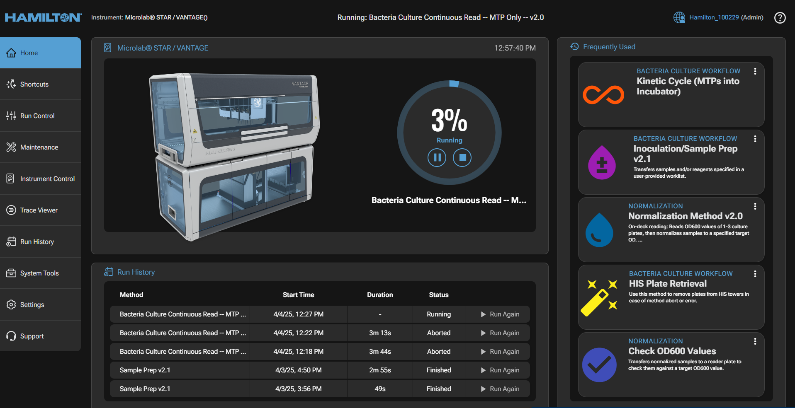
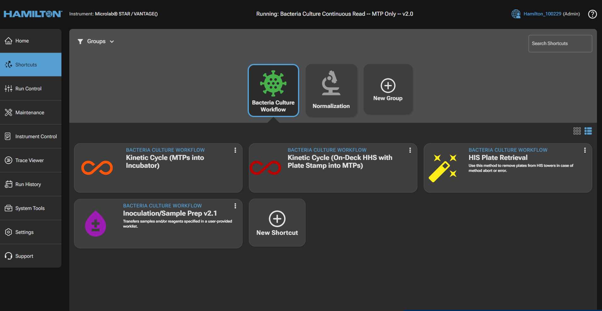
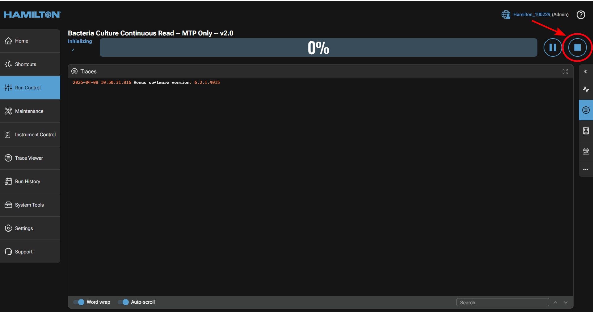
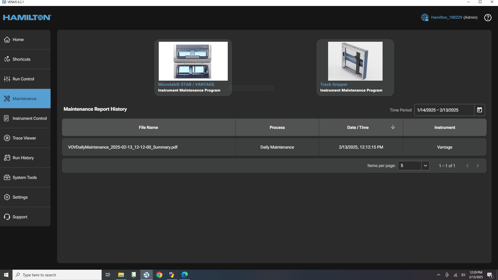

# Hamilton Star Robot Overview

The Hamilton STAR is a flexible, high‑precision liquid‑handling workstation designed to automate virtually any pipetting workflow in your lab—from simple reagent transfers to complex, high‑throughput assay setups. By combining an _XYZ_ gantry with interchangeable pipetting heads (e.g., 8‑ or 96‑channel), grippers and plate shuttles, the STAR can handle microplates, tubes and reservoirs in virtually any format. Integrated software (Venus) allows you to build, simulate and run protocols with drag‑and‑drop simplicity, while on‑deck accessories (shakers, heaters/coolers, tip racks, bar‑code readers) extend its capabilities to include sample mixing, temperature control and plate tracking.

When planning your STAR workflows, keep in mind key considerations for optimal performance and reliability. First, regular calibration of pipetting channels and deck positions is critical—schedule daily or weekly checks depending on throughput. Use filtered, sterile tips and routinely inspect the wash stations to prevent cross‑contamination. Ensure your deck layout balances throughput with accessibility for cleaning and maintenance: leave clearance around modules for tip loading and waste removal. Finally, maintain a clean, temperature‑controlled environment (ideally 18–25 °C with low humidity) and follow the manufacturer’s preventive‑maintenance schedule (including lubrication and filter changes) to minimize downtime and extend the life of your instrument.

## Start up
This is the first prompt you will see after starting the Hamilton Venus software. On the left you will see a GUI that allows you to interact with starting, stopping, and tracking the progress of your methods. This is the hub for the high-level implementation of methods. No method editing occurs here.

The shortcuts tab is where the production-level methods should sit, allowing users to efficiently navigate to common, working methods. One can simple double click on a method to queue its startup process, either in simulation to test the code and parameters, or in run mode to run the specified protocol.

## Important Directories and Files
### Main Path
* ``This PC/OS(C:)/Program Files (x86)/Hamilton``
#### Methods folder
* ``This PC/OS(C:)/Program Files (x86)/Hamilton/Methods/Venturelli Lab/Resources/Methods`` 
    * ``Method_X.med`` - Human readable method file
    * ``Method_X.hsl`` - Robot encoded method file
#### Plate reader results folder
* ``This PC/OS(C:)/Program Files (x86)/Hamilton/Duke/Hourly OD/Reader Output Files``
    * ``YYMMDD`` - Date folder
        * ``PlateName_YYMMDD_hhmmss.csv`` - Plate reader results
#### Worklist fold
Where is were the worklist files should be stored
* ``This PC/OS(C:)/Program Files (x86)/Hamilton/Duke/Sample Prep/Input Files``
    * ``worklist.csv`` - Worklist file
## Method abortion
At any given time, the method can be aborted by navigating to the top-right corner. This can be done if you see an error, such as a gripper mishandling a plate, that is not caught by the instrument, or if you’d like the method to stop prematurely. Be aware that if any plates are left in the incubators, or the plate-reader, separate protocols need to be run in order to retrieve these resources.

## Maintenance
Maintenance of the Hamilton STAR is crucial for ensuring optimal performance and longevity of the instrument. For routine maintenance, select the maintenance icon on the home screen:

This will take you to the maintenance screen, where you can select the type of maintenance you would like to perform. The Hamilton STAR requires both daily and weekly maintenance:
- **Daily**: Cleaning the deck, checking for clogs, and ensuring all components are functioning properly. This should be done on a daily basis to ensure the instrument is in good working condition.
- **Weekly**: Inspecting and cleaning the pipetting heads, checking the gripper for wear, and ensuring all software is up to date.
To choose the type of maintenance you would like to perform, select the appropriate icon on the maintenance screen. This will take you to a detailed guide for performing the selected maintenance task.

## Pipetting and Arm Systems
### CO‑RE Pipetting Arm
The STAR’s primary liquid‑handling arm employs Hamilton’s CO‑RE (Compressed O‑Ring Expansion) technology with disposable tips. You can equip it with an 8‑channel head for moderate‑throughput tasks—like serial dilutions, plate‑based assays, or transfers between multiple labware types—or swap in a 96‑channel head to fill or empty entire 96‑well plates in one go. CO‑RE tips “snap” into place with built‑in force sensing, ensuring consistent seating and liquid detection; this yields high accuracy and precision across a broad volume range (typically 0.5–1000 µL) while minimizing tip‑touch and carryover.
### Fixed‑Tip Pipetting Arm
For workflows that involve large‑volume reagent distribution or where consumable costs must be minimized, the STAR can be configured with a fixed‑tip arm. Stainless‑steel tips stay attached to the arm and are cleaned between transfers in an on‑deck wash station. This setup excels at bulk dispensing (e.g., >500 µL per channel) and repetitive transfers where cross‑contamination risk is low—but requires rigorous wash protocols and periodic tip inspection to prevent carryover.
### Tip Gripper Arm
Beyond liquid handling, the STAR features a dedicated gripper arm for labware manipulation. With two independent gripper modules, it can pick up and reposition plates, tube racks, reservoirs, and tip boxes anywhere on the deck. Automating tip‑rack loading, plate shuttling to off‑deck modules (like plate readers or incubators), and deck reconfiguration mid‑protocol reduces manual intervention and helps maintain reproducible orientation and spacing.
### High‑Density Pipetting Head
For ultra‑high‑throughput or miniaturized assays, you can add a 384‑channel pipetting head. This head handles sub‑10 µL volumes across all wells of a 384‑well plate simultaneously, making it ideal for screening campaigns or scarce sample scenarios. Because of the small volumes and high channel count, precise calibration, deck leveling, and regular performance checks are critical to maintain accuracy and avoid well‑to‑well variability.